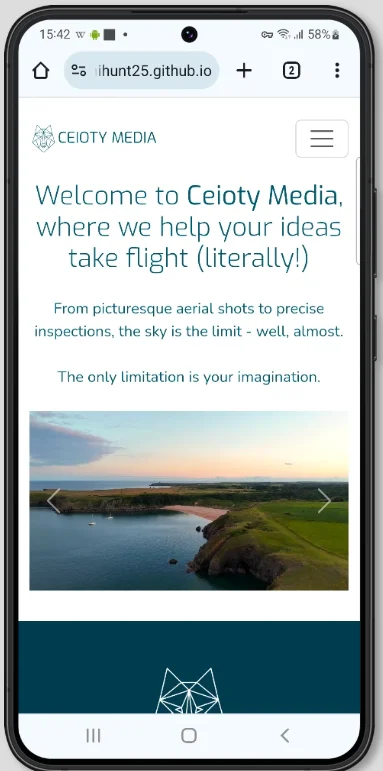

# Milestone Project 1 - Ceioty Media


***

## Project description

This project is designed for Unit 1: User-Centric Front-End Development, the project involves the design and development of a front-end web application. For the purpose of this project, I have chosen to create a website for **Ceioty Media**, a fictional drone service company that offers drone filming, photography and survey inspection services. This website will be designed with a focus on user experience (UX), utilising responsive design principles, effective content layout, and intuitive navigation to ensure the site is user-friendly across all devices.

Though the business context is based on Ceioty Media, the core focus of this project is to apply the web development principles I have learnt in the course so far, demonstrating the skills required to build a functional, professional, and engaging website.

***

## User experience (UX)

### Project goals
1. **Responsive design**:
The website will be designed to work across all device types, ensuring an optimal viewing experience for users on desktops, tablets, and smartphones. It will adjust seamlessly to different screen sizes without losing content structure or usability.

2. **Content layout**:
The content will be laid out in a structured which is easy to navigate, there will be clear sections that allow users to find the information they need quickly. 

3. **User-centric interface**:
The site will be designed with a focus on the target audience's needs, ensuring a positive user experience. Features like quick navigation, easy-to-read fonts, and fast load times will be prioritised for ease of access. The content will also be optimised for accessibility, providing an inclusive experience for all users.

4. **Interactive elements**:
The website will feature interactive elements, such as hover effects and image sliders, making the site engaging and user-friendly. This will encourage users to explore the services offered and contact the company.

### Ceioty Media's goals
1. **Increase customer engagement**: Encourage visitors to explore services, view the portfolio, and contact Ceioty Media for bookings or enquiries.

2. **Showcase portfolio to raise brand awareness**: Highlight the company’s specialisation in drone services, including event coverage, business promotion, inspections, and B-Roll footage, with visually engaging content.

3. **Simplify user navigation**: Provide an intuitive, seamless user journey with clear calls-to-action and easy access to information.

4. **Drive conversions**: Optimise the website for lead generation by placing clear calls-to-action where relevant.

### User stories
|No.|User Story|
| ------------- | ------------- |
|1|As a **visitor**, I want to view a visually appealing and professional homepage so that I can quickly understand what services Ceioty Media offers. <br><br>**Task:** Ensure visitors can see a clear introduction, key services, and calls to action.|
|2|As a **potential client**, I want to learn about the drone services offered so that I can determine if they fit my project needs. <br><br>**Task:** Write descriptions of services (e.g. filming, photography, inspections) are available on the services page.|
|3|As a **business owner**, I want to see examples of past work so that I can assess the quality of work and creativity. <br><br>**Task:** Creat a portfolio page that displays high-quality images and videos of past work.|
|4|As a **property manager**, I want to learn about commercial property services so that I can enhance my property listings with aerial footage. <br><br>**Task:** Write information on commercial property services on the services page and add work to portfolio.|
|5|As a **visitor**, I want to easily navigate the website so that I can find the information I need quickly and efficiently. <br><br>**Task:** the website has a clear navigation bar with links to key pages.|
|6|As a **mobile user**, I want the website to be fully responsive so that I can access it seamlessly on any device. <br><br>**Task:** Ensure the website displays correctly on different screen sizes and are easy to navigate on mobile and tablet devices.|
|7|As a **potential client**, I want to be able to contact Ceioty Media easily so that I can enquire about services or request a quote. <br><br>**Task:** Create a contact page which includes a contact form, phone number, and email address.|
|8|As a **user with a visual impairment**, I want the site to be accessible so that I can comfortably navigate and use its features. <br><br>**Task:** Ensure the site passes accessibility tests, including contrast checks and screen reader compatibility.|

## Design choices
For the design of the website, I opted for a sleek and minimalistic aesthetic for a clean, modern, and professional user experience. The goal was to create a website that is visually appealing without overwhelming the user with unnecessary elements or clutter. By keeping the design minimal, I aimed to focus attention on the core content including services, portfolio, and contact information, making it easy for visitors to navigate and absorb the important details of the business. This approach also enhances usability and ensures that the website looks polished across all devices and screen sizes, aligning with the principles of responsive design.

### Typography choices
1. Primary Font: Exo
I chose Exo as the primary font for the website due to its modern, geometric, and clean design. The font features sharp edges and clear lines that convey professionalism that are essential for a drone services business. Its legibility at various sizes, particularly in headers and titles, ensures that the text remains easily readable across different devices. Additionally, Exo has a futuristic feel, aligning with the technological and innovative nature of the drone industry.

2. Secondary Font: Nunito
For the secondary font, I chose Nunito for its rounded, approachable, and soft appearance. This font complements Exo by offering a contrast in terms of shape and tone. Nunito provides a sense of warmth and friendliness, balancing the more technical and modern look of Exo. This makes it ideal for body text, as it is easy to read and creates a welcoming atmosphere for visitors. 

The combination of both fonts results in a harmonious and professional design, with Exo bringing a contemporary, high-tech vibe, while Nunito enhances readability and user engagement.

### Icons
For the icons used throughout the website, I ensured that they were simple, intuitive, and easily understood. By using widely recognised icons, I aimed to reduce any potential confusion and improve the overall user experience. The use of recognisable icons enhances the website's accessibility, as users can quickly understand the meaning of each icon contributing to a clean, uncluttered interface that focuses on content and interaction.

### Colour palette
The colour palette for the website was chosen with both aesthetic appeal and accessibility in mind. The primary colour is deep teal (#005C6E), reflecting the company's coastal roots in Pembrokeshire, where much of their portfolio work focuses on capturing stunning coastline views.

***

## Wireframes (UX)
The wireframes below showcase the designs planned the Ceioty Media website. They serve as a blueprint to guide the development process, ensuring that the site is user-focused and meets the needs of its intended audience.

### Index page design


### Services page design


### Portfolio page design


### Contact page design


### Success page design


***

## Features
### **Home page**
The home page serves as the first point of interaction for users, designed to be visually striking and informative:
- **Hero section**: Features a captivating background image of Pembrokeshire’s coastline, along with the company name and slogan, reflecting the brand identity.  
- **Introduction**: Provides a concise overview of Ceioty Media’s services, showcasing their expertise and creative approach.  
- **Navigation bar**: A responsive navigation bar allows easy access to all major pages, ensuring a seamless experience across devices.
 

### **Services page**
The services page details the range of professional drone services offered by Ceioty Media:
- **Service descriptions**: Each service is clearly explained, so visitors can clearly see what Ceioty Media has to offer.  
- **Visual elements**: Accompanied by high-quality images to provide context and showcase expertise. 


### **Portfolio page**
The portfolio page is a showcase of Ceioty Media’s best work, designed to impress and inform potential clients:
- **Gallery layout**: A responsive grid displays high-resolution images and embedded videos.  
- **Variety of project**: The portfolio highlights a diverse array of projects that demonstrate Ceioty Media's expertise and creativity.


### **About us page**
The about page provides an overview of Ceioty Media’s history, expertise, and passion for creativity:
- **professional and personal Tone**: Highlights the company's story, from its establishment in 2020 to its mission of delivering unique perspectives.  
- **Credentials and insurance**: Emphasises trustworthiness with details of drone licensing, £5 million public liability insurance, and commercial coverage.  


### **Contact page**
The contact page makes it simple for clients to get in touch:
- **Contact form**: Includes fields for name, email, and a message, ensuring clear communication.  
- **Success feedback**: Users are redirected to a submission success page, confirming their message has been received.  
- **Location details**: Includes information about Ceioty Media’s location.  


### **Footer**
The footer is consistently present across all pages and provides useful links and contact information:
- **Social media integration**: Links to Ceioty Media’s social media accounts, encouraging engagement.  


***

## Testing 
### User stories testing
|No.|Pass/Fail|Evidence|
| ------------- | ------------- | ------------- |
|1|Pass|As a **visitor**, I want to view a visually appealing and professional homepage so that I can quickly understand what services Ceioty Media offers. <br><br>**Task:** Ensure visitors can see a clear introduction, key services, and calls to action. <br><br>**Evidence**: The homepage includes a strong header with a clear introduction about Ceioty Media’s services, such as aerial footage, event coverage, and photography. The services are succinctly explained, with visual elements guiding users toward actions like viewing social media channels or making enquiries.|
|2|Pass|As a **potential client**, I want to learn about the drone services offered so that I can determine if they fit my project needs. <br><br>**Task:** Write descriptions of services (e.g. filming, photography, inspections) are available on the services page. <br><br>**Evidence**: On the Services page, Ceioty Media clearly lists its drone services, offering concise yet informative descriptions of drone filming, aerial photography, and property inspections.|
|3|Pass, more required|As a **business owner**, I want to see examples of past work so that I can assess the quality of work and creativity. <br><br>**Task:** Creat a portfolio page that displays high-quality images and videos of past work. <br><br>**Evidence**: The Portfolio page displays an organised gallery of past projects, each showcased with high-quality images and videos. Testimonials would be a great feature to have added but was not a mandatory feature.|
|4|Pass|As a **property manager**, I want to learn about commercial property services so that I can enhance my property listings with aerial footage. <br><br>**Task:** Write information on commercial property services on the services page and add work to portfolio. <br><br>**Evidence**: The Services page includes a  section detailing Ceioty Media’s commercial property services.|
|5|Pass|As a **visitor**, I want to easily navigate the website so that I can find the information I need quickly and efficiently. <br><br>**Task:** the website has a clear navigation bar with links to key pages. <br><br>**Evidence**: The website features a navigation bar at the top of every page with clear and well-labeled links to the Home, Services, Portfolio, and Contact Us pages. The navigation is fixed, staying at the top of the screen as the user scrolls.|
|6|Pass|As a **mobile user**, I want the website to be fully responsive so that I can access it seamlessly on any device. <br><br>**Task:** Ensure the website displays correctly on different screen sizes and are easy to navigate on mobile and tablet devices. <br><br>**Evidence**: The website adapts perfectly to different screen sizes, whether viewed on a mobile phone, tablet, or desktop. Images resize correctly, and the navigation bar collapses into a hamburger menu on smaller screens.|
|7|Pass|As a **potential client**, I want to be able to contact Ceioty Media easily so that I can enquire about services or request a quote. <br><br>**Task:** Create a contact page which includes a contact form, phone number, and email address. <br><br>**Evidence**: The Contact page features a simple, user-friendly contact form where potential clients can submit inquiries directly. Additionally, the page lists Ceioty Media’s phone number and email address for alternative methods of contact. Clear CTAs guide visitors to fill out the form or call for more details.|
|8|Pass|As a **user with a visual impairment**, I want the site to be accessible so that I can comfortably navigate and use its features. <br><br>**Task:** Ensure the site passes accessibility tests, including contrast checks and screen reader compatibility. <br><br>**Evidence**: The website passes accessibility tests. Additionally, alt text is provided for all images, making the site fully compatible with screen readers.|

***

### Validator testing
- **HTML**
    - Index page: No errors were returned when passing through the official W3C validator<br> https://validator.w3.org/nu/?doc=https%3A%2F%2Fnaomihunt25.github.io%2Fceioty-media%2Findex.html 
    - Services page: No errors were returned when passing through the official W3C validator<br> https://validator.w3.org/nu/?doc=https%3A%2F%2Fnaomihunt25.github.io%2Fceioty-media%2Fservices.html 
    - Portfolio page: No errors were returned when passing through the official W3C validator<br> https://validator.w3.org/nu/?doc=https%3A%2F%2Fnaomihunt25.github.io%2Fceioty-media%2Fportfolio.html 
    - Contact page: No errors were returned when passing through the official W3C validator<br> https://validator.w3.org/nu/?doc=https%3A%2F%2Fnaomihunt25.github.io%2Fceioty-media%2Fcontact.html 
    - Success page: No errors were returned when passing through the official W3C validator<br> https://validator.w3.org/nu/?doc=https%3A%2F%2Fnaomihunt25.github.io%2Fceioty-media%2Fsuccess.html

- **CSS**
    - No issues were found after validating through the official Jigsaw validator<br> https://jigsaw.w3.org/css-validator/validator?uri=https%3A%2F%2Fnaomihunt25.github.io%2Fceioty-media%2Findex.html&profile=css3svg&usermedium=all&warning=1&vextwarning=&lang=en
    
***

### Accessibility testing
I utilised Lighthouse within the Google DevTools to review the colours and fonts used. The outcomes are displayed below. Lighthouse also evaluates areas such as Performance, SEO, and Best Practices.

**Index page** <br>


**Services page** <br>


**Portfolio page** <br>
 <br>
The portfolio page received a score of 77 for performance and 78 for best practices during the Google DevTools Lighthouse audit.<br>

*Performance*: The page scored 77 because, although the images were compressed and converted to the WebP format to optimise loading times, the high-quality images used were necessary to showcase the drone services effectively. This aligns with the requirements of User Story 4, which emphasised presenting high-resolution visuals to highlight the offerings. Additionally, YouTube videos were embedded instead of using the video tag, helping to improve loading speed by utilising YouTube's optimised streaming infrastructure.<br>

 <br>
*Best practices*: The score of 78 was impacted by warnings about the use of third-party cookies, which arose from embedding YouTube videos. Since these cookies are an inherent part of YouTube's embedding functionality, they could not be modified or removed.

**Contact page** <br>


**Success page** <br>


### Manual testing
- I’ve tested the website to ensure it functions across multiple web browsers. 
- The site has been checked on a variety of device sizes to confirm it’s fully responsive, maintaining its design and functionality. 
- Every link on the page (both internal and external) has been tested to verify they open correctly and lead to the right destinations. 
- I reviewed the text and fonts to guarantee they are clear, easy to read, and user-friendly. 
- The contact form was also tested to ensure they only allow valid entries and successfully redirect users to the confirmation page after submission. 
Below are some screenshots showcasing how the site appears on different devices.

### Desktop
|Chrome 131.0.6778.109|Safari 17.4.1|Firefox 133.0|
| ------------- | ------------- | ------------- |
||||
||||
||||
||||
||||

### Mobile and tablet
|Mobile - Safari iOS 18|||
| ------------- | ------------- |------------- |
|||| 
|||| 

|Android mobile - Chrome 131|||
| ------------- | ------------- |------------- |
||||
|||| 

|Tablet - Safari iOS 18|||
| ------------- | ------------- |------------- |
||||
|||| 

***

### Fixed bugs
#### Bug 1
The background colour for the About section was not spanning the full width of the page.<br><br>
*Original code*:<br>
```css
#about {
    background-color: var(--secondary-color);
}
```
*New code*:<br>
```css
#about {
    background-color: var(--secondary-color);
    margin: 0;
    min-width: 100%;
    padding-bottom: 2rem;
}
```
#### Bug 2
The embedded Youtube videos were not showing full height to match the height of the images on portfolio page.<br><br>
*Original code*:<br>
```css
#media {
    line-height: 0;
}
```
*New code*:<br>
```css
#media {
    line-height: 0;
}

#media .modal-fullscreen {
    aspect-ratio: 16 / 9;
    width: 100%;
}
```
#### Bug 3
The portfolio page media was showing white space in between columns.<br><br>
*Original code*:<br>
```css
/* Large devices (small laptops, 992px and up) */
@media screen and (min-width: 992px) {

    #media {
        column-count: 3;
    }
}
```
*New code*:<br>
```css
/* Large devices (small laptops, 992px and up) */
@media screen and (min-width: 992px) {

    #media {
        column-count: 3;
        font-size: 0;
    }
}
```

***

### Deployment
**GitHub pages** 
The website is hosted on GitHub Pages. To deploy it, follow these steps:
1. Sign up to [Gitpod](https://gitpod.io/)
2. Download the Gitpod browser extension.
3. Navigate to the *Settings* tab in the [naomihunt25/ceioty-media repository](https://github.com/naomihunt25/ceioty-media) on GitHub.
4. Click *Pages* within the code and automation section located on the left-hand side.
5. In the *Branch* section, choose "main" branch and click *Save*.
6. Once saved, the page will display a link under the deployment section on the [naomihunt25/ceioty-media repository](https://github.com/naomihunt25/ceioty-media), click *github-pages*.
7. The Deployment page will be showing your live site URL. Click on the link to access the deployed website.

**Fork**
1. On [Gitpod](https://gitpod.io/), navigate to the [naomihunt25/ceioty-media repository](https://github.com/naomihunt25/ceioty-media).
2. Click on the *Fork* button at the top-right corner of the page.
3. Add a description to your fork.
4. Click create fork to finalise the process.

**Clone** 
1. On [naomihunt25/ceioty-media repository](https://github.com/naomihunt25/ceioty-media), click the *Code* button above the list of files.
2. Copy the repository URL.
3. Open your terminal and navigate to the directory where you want to store the clone.
4. Type git clone followed by the copied URL.
5. Press enter to clone the repository.

Live link - [Ceioty Media](https://naomihunt25.github.io/ceioty-media/index.html)

***

### Credits
#### Content
- Elements and methodologies from [Code Institute](https://codeinstitute.net/)'s Love Running project and the Boardwalk Games project were utilised as inspiration and guidance in the development of this website
- I used [Bootstrap](https://getbootstrap.com/) v5.3 to create key elements within the site including the auto-play slideshow, buttons and form
- To ensure a thorough understanding of HTML and CSS code I wasn't confident with before implementation, I referred to [W3Schools](https://www.w3schools.com/) for guidance

### Colour palette
- I used [ColorSpace](https://mycolor.space/?hex=%2300FFD2&sub=1) to create the colour paletter for the site

### Fonts
- I used [Fontjoy](https://fontjoy.com/) to choose my primary and secondary font
- The primary and secondary font that were used were from [Google Fonts](https://fonts.google.com/)

### Media
#### Icons
- Icons located in the footer were taken from [Font Awesome](https://fontawesome.com/)
- Icons used for the services were created on [Canva](https://www.canva.com/en_gb/)
- Personalised favicon was generated by [favicon.io](https://favicon.io/)

#### Images and Video
- All screenshots were taken from Ceioty Media's deployed site
- The images and videos featured on the index and portfolio pages are my own original creations and property
- Videos were embedded using [Youtube](https://www.youtube.com/)'s code 
- I created wireframes using the [Balsamiq](https://balsamiq.com/) software


